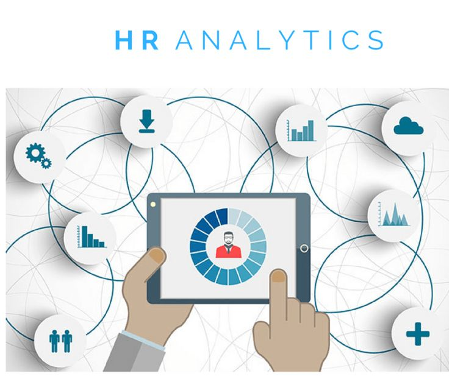
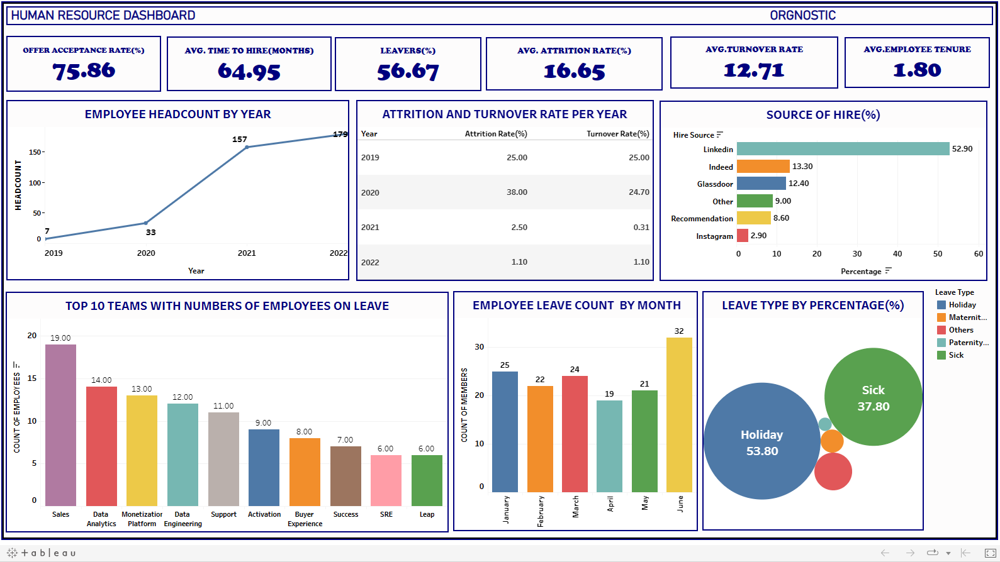
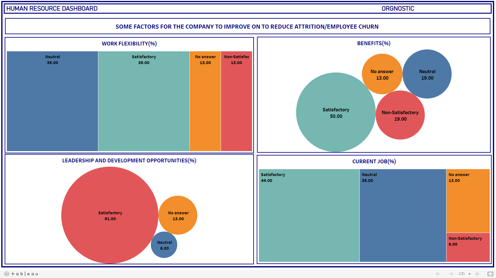

# Orgnostic_HR_Analytics

## INTRODUCTION
Human resources (HR) analytics is simply the use of data analysis techniques to gain insights into various HR-related metrics such as workforce demographics, employee turnover, performance, recruitment, training, and development. The goal is to use data to measure, optimize performance, engagement, retention, HR process and practices. Also, to drive strategic decision making related to the workforce.

## ABOUT THE DATASET	

The dataset used for this project consist of four (4) tables namely Employees, Exit Reasons, Applications and Employee Leaves.
The tables with their fields/columns are below
-	Employees: Employee id, department, team, location, hire date, termination date and termination type.
-	Exit Reasons: Employee id, work flexibility, vision clarity, values fit, perks, peer quality, office proximity, manager quality, long term value of cash compensation, long term career opportunity, long term value of equity, learning and development opportunities, leadership team equity, job fit, immediate value of equity, immediate value of cash compensation, current job level, coordination and organization, company reputation and benefits.
-	Applications: Applicant id, job offered, hired, date applied, date hired and source.
-	Employee leave: Employee id, department, team, location, leave type, month and length (Days). 

This dataset is provided by **Orgnostic.**
_Source of dataset: From the monthly data visualization challenge by DATA IN MOTION LLC._

 ## BUSINESS QUESTION

The Business problem is focused on but not limited to the following areas:
-	Recruiting: The average time to hire, offer acceptance rate and source of hire.
-	Absenteeism: Types of leaves, month with highest leaves
-	Employee Lifecycle:  Headcount, departmental metrics and employee tenure.
Others include turnover rate, attrition rate, etc.

## FINDINGS & VISUALIZATION 

Link for Visualization [Click_here.](https://public.tableau.com/app/profile/sherif.atanda/viz/Orgnostic_HR_Dashboard_2/Orgnostic_Dashboard?publish=yes)

Link for Visualization [Click_here.](https://public.tableau.com/app/profile/sherif.atanda/viz/Orgnostic_HR_Dashboard_2/Exit_Reasons?publish=yes)

## INSIGHTS

-	Headcount (By year): Headcount is simply the number of employees in a company at a given period of time. This is useful to HR professionals such that it helps to assess workforce growth, avoid overstaffing and making informed decision regarding, hiring and budgeting.
-	Employee Average Tenure: This is the average amount of time an employees has worked for a company. It can be classified as either short or long tenure. For most part, long term is granted to employees who have worked for the company for five (5) years. Short term is roughly two (2) years or less. Generally, employees who have stayed on board for two (2) – four (4) years have average tenure. Te see, click [here](https://www.indeed.com/career-advice/career-development/tenure-in-a-job)
 From the dashboard, the result shows that the average tenure of employees in the company is 1.8 years. This can be traced to the fact that the dataset was between 2019 and 2022. This is good such that it helps the company to increase productivity through the experienced members and reduce cost of training new staff.	
-	Attrition Rate: This is expressed in percentage. It provides the percentage of the workforce at a given time that left the company. Either voluntarily or Involuntary. A yearly attrition rate was provided during the analysis. From 2019 to 2020, there was an increase. This can be traced to some reasons. Either they got a better offer in other company or their current workplace is dissatisfactory. 
But from 2021 to 2022, there was a drastic decrease, this shows that the company was able to retain employees.
-	Employee Turnover Rate: This is similar to attrition rate but there is a slight difference. Having explained attrition rate, turnover is when an employee leaves a company voluntarily. It can also be called” Employee Churn”. It can also be used to refer to the percentage of employees that needs to be replaced. Turnover is usually when they leave for a better company. From the dashboard, it can be seen that this decreased from 2019 till 2021, but increased slightly. This shows that the company has been able to retain its employees through some factors. Such as providing leadership and development opportunities, benefits, etc. But for the slight increase, there is something about the workplace that needs to be adjusted (One of this is the work flexibility).
-	Top ten (10) teams based on count of employees on leave.
-	Classifying the Leave type by percentage.
-	Month with the highest count of employees on leave.
-	The perceratage of employees that went on leave.
-	Effective Source of Hire: From the dashboard, it can be seen that LinkedIn and Indeed respectively had the highest percentage compared to another source. 
-	Average Time to Hire: This can be referred to the timeframe between the time a job is posted or when a candidate applied till the best candidate is offered the job.
From the dashboard, the average time to hire was about 65 days. This could be due to the complexity of the job or the need for specialized skills. 
-	Offer Acceptance Rate (OAR): This is the percentage of candidates that accepted a formal job offer. From the dashboard. It was over 75%. This signifies that there were certain advantages the candidate saw. It may be better salary, benefits, etc. 

## RECOMMENDATIONS

-	Regular assessing/monitoring of employees’ headcount from time to time to avoid overstaffing. This is also useful when some employees are on different kind of leaves. 
-	Learning and development opportunities, work flexibility and benefits should be improved upon to optimize employee retention. 
This helps to avoid losing employees who are able to increase productivity due to their long tenure. Also, this helps to minimize the cost of training new staffs.
-	From the classification of leave by percentage, the second highest type (‘Sick’). This could be that the employees are experiencing burnout (a state of physical, emotional and mental exhaustion caused by prolonged stress, overwork, and a lack of resources and support).
Some of the ways to prevent this is to promote a positive work culture, this include getting feedback, recognizing employees’ contribution. Also, providing mental health counselling.
Lastly, ensure work life balance. This means encouraging employees to take time off, maintain regular wok hours and prioritize self-care.
-	For subsequent job posts, LinkedIn and Indeed should be used, especially when the job position has to be filled in short time.
-	There is need to improve the time to hire. This is because for every best candidate, there will always be companies that will need the service of such individual in some days which is less that the average time to hire from the dashboard.
The Hiring team should be trained on how to spot the best for a role more quickly. Also, the hiring stages should be reviewed to know which took time than the other so as to improve.

## CONCLUSION

Having provided answers to the business questions asked, though the analysis was limited due to the size and information provided in the dataset. Records about demographics of employees, salary could have helped in further analysis.

Nevertheless, this analysis highlights the importance of data-driven decision making in HR practices, and reveals the potential benefits of leveraging HR analytics to improve and enhance overall performance.
 

